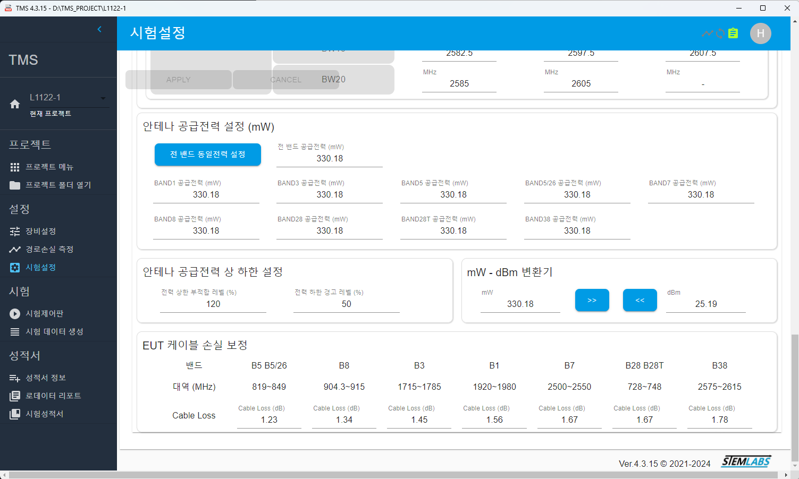

# Hank (Kwanghaeng) Lee Projects

## 전파 인증 시험 자동화 시스템
### Brief
전파 인증 시험을 자동으로 테스트하고 결과보고 문서를 자동생성하는 시스템을 개발함.
### 시스템 구성
1. TMS : ElectronJS, React, Python 
   1. 시험항목 및 테스트 시나리오 작성
   2. 측정장비 설정
   3. 측정 시나리오에 따른 자동측정
   4. 측정 결과 보고서 생성기 (.xlsx, .docx)
 
<em>TMS Screen Shot</em>

1. TIS-DDS : Python Flask, MariaDB, React
   1. 시험데이터 저장 DB
   2. 사내 시험 프로젝트 서버와 연결 및 조회

### Techs
Electron.JS, React, Flask, MariaDB, Microsoft Office API, JavaScript, Python

## WebPT
### Brief
사내 보고서와 프리젠테이션 데이터를 서버에 일괄 보관하며 office format (.pptx) 으로 존재하는 문서를 web 을 통해 이미지로 프리젠테이션 가능하도록 지원한다. pptx 내에 존재하는 link 와 Image 데이터를 서버에서 자동으로 분리해 내 관리하며 이를 Browsing 할 수 있는 Web application 을 구현한다.

### Techs
Java, Tomcat, MariaDB, Javascript, CSS, C#, Office access .net library
